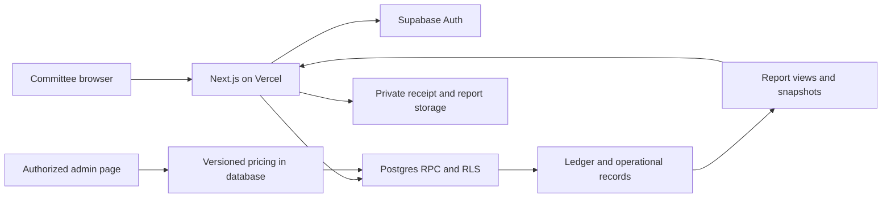

# Technical implementation document

Version 1.0 · 21 September 2026 · Design specification, not deployed code

Read with [PLAN.md](PLAN.md) and [WORKBOOK_ANALYSIS.md](WORKBOOK_ANALYSIS.md). Confirmed business rules in PLAN.md take precedence over historical spreadsheet formulas.

## 1. Architecture

Use one Next.js application with App Router and TypeScript. Supabase supplies Postgres, Auth and private object storage. Server Components load authenticated pages; Server Actions validate mutations and call transactional Postgres functions. Route Handlers serve protected exports and authentication callbacks. No separate Express backend is required.



Use `@supabase/supabase-js` and `@supabase/ssr` for session-aware clients. Follow the current official SSR guidance for verified claims and cookie refresh; do not trust a cookie-only session read as authorization. Match `proxy.ts` versus `middleware.ts` to the chosen Next.js major version. All sensitive mutations also check database membership. See [Supabase Next.js SSR](https://supabase.com/docs/guides/auth/server-side/creating-a-client?queryGroups=framework&framework=nextjs).

At implementation start, select and lock current stable compatible Next.js, React, Node LTS, Supabase CLI and package versions. Commit the package lockfile and record the selected versions. Use Tailwind and accessible form/table components, schema validation such as Zod, Vitest for business rules and Playwright for user flows. SQL migrations and pgTAP/integration tests own database invariants. Browser-native print-to-PDF is sufficient for launch; a server PDF renderer is optional later.

Supabase is the source of truth. Avoid introducing a second ORM migration system. Generate TypeScript database types from the migrations. Ordinary requests use the signed-in user's JWT and RLS, not an all-powerful service key.

## 2. Repository layout

The private repository is `prishi-ai/festival-management`. It is independently cloned in `PrishiAI/festival-management` and ignored by the parent repository; it is not a Git submodule. The initial delivery contains documentation only. The implementation will add:

```text
festival-management/
  docs/PLAN.md
  docs/IMPLEMENTATION.md
  docs/WORKBOOK_ANALYSIS.md
  src/app/(auth)/login/
  src/app/(admin)/admin/festivals/   # creation, days, flats and charges
  src/app/(admin)/admin/users/       # Google invites and role management
  src/app/(committee)/festivals/[festivalId]/
    dashboard/ my-entries/ flats/ collections/ holders/ expenses/
    meals/ catering/ events/ reports/
  src/app/auth/callback/route.ts
  src/app/api/reports/[reportId]/route.ts
  src/components/
  src/lib/supabase/          # browser, server and session refresh
  src/lib/domain/            # money, age classification, display helpers
  src/lib/validation/
  src/types/database.ts
  supabase/migrations/
  supabase/tests/
  supabase/seed.sql          # synthetic local demo only
  scripts/import-workbook.ts
  scripts/verify-reconciliation.ts
  tests/e2e/
  .github/workflows/ci.yml
  .env.example
```

Use `main` for approved changes and `codex/<feature>` branches for subsequent work. Initial documentation may be committed directly because the supplied repository is empty. Never commit the original workbook, resident data, receipts, generated reports, backups or secrets. Production configuration belongs in Supabase/hosting settings; checked-in examples must contain placeholders only.

## 3. Domain boundaries and data types

- Every festival belongs to a society; every operational row carries `society_id` and, where applicable, `festival_id`. This prevents accidental cross-festival mixing even though launch serves one society.
- Primary keys: UUID. Timestamps: `timestamptz` stored in UTC. Festival/meal dates: `date` interpreted in `Asia/Kolkata`. Store both occurrence date/time and server-recorded time for financial entries.
- Money: integer paise in Postgres `bigint`; serialize to decimal strings at API boundaries to avoid JavaScript precision loss. No floating-point arithmetic for money.
- People/plates: nonnegative integers. Supply quantities such as litres: `numeric(12,3)` with explicit unit. Round supply quantity × paise rate once per line using a documented half-up policy.
- Financial documents have draft and posted states. Posted rows are immutable; corrections use linked reversal/credit documents. Drafts can be edited with optimistic version checks.
- Entry review is a separate state: `awaiting_confirmation` or `confirmed_locked`. Only an admin can confirm/lock or unlock. Committee ownership grants editing only while awaiting confirmation; journal posting or payment verification alone does not remove that right.
- Use explicit unique constraints and same-society/festival composite foreign keys. Application filtering alone is insufficient.
- Preserve Gujarati names/labels in UTF-8. Do not translate stored names on every render.

## 4. Logical schema

All tables include identifiers and creation metadata. Mutable operational tables include `updated_at`, `updated_by`, and `version`. Financial documents include business date, status, source reference, posted timestamp/actor, and optional reversal link.

Inflow/expense entry roots also store `review_state`, `confirmed_by`, `confirmed_at`, and `confirmed_version`. A confirmed entry must have all three confirmation fields and `confirmed_version = version`; an awaiting-confirmation entry has no active confirmation fields. Preserve past confirmations/unlocks in the audit history. Every financial correction revision and supporting attachment/line/allocation mutation checks the same stable entry root lock. The review state belongs to the whole entry, not just its current journal row.

A lock preserves the confirmed entry's contents; it does not prevent a separate later receipt/payment from settling a confirmed charge/bill. Record that settlement as a new entry with its own review state and immutable link to the original. Derived outstanding balances may change without rewriting the confirmed bill. Editing the original amount, source account or existing allocation still requires unlocking the relevant entry.

### Society, flats, festival and pricing

| Table | Principal fields and relationships |
| --- | --- |
| `societies` | name, timezone, currency |
| `profiles` | `auth.users` id, display name; private contact details only when needed |
| `society_memberships` | society, user, `admin/committee` role, active status; unique society/user |
| `festival_memberships` | festival, society membership, active status; committee scope, managed by admin |
| `member_invitations` | society, exact normalized Google email, requested role, invited by, expiry, status, claimed user ID and timestamps; optional hashed one-use invitation token |
| `flats` | society, block, flat_number, display label, active status; unique `(society_id, block, flat_number)` |
| `residents` | flat, optional display name, active status; DOB optional; count-only households supported |
| `festivals` | society, name, start/end dates, configurable day count, status `draft/open/closed`, close revision |
| `festival_days` | festival, sequence, date, label, Dussehra flag; unique festival/date and festival/sequence; explicit services beneath each day |
| `festival_flats` | festival, flat, fee eligibility/exemption reason, enrollment state; one per flat/festival |
| `pricing_versions` | festival, version, effective date, currency, `draft/active/retired`, operator/change reason |
| `festival_rates` | pricing version, compulsory fee, adult/child/under-seven package rates, inclusive age limits, household entitlement policy |
| `meal_services` | festival, date, meal type, service code, cutoff, inclusion mode, status; unique service code per festival |
| `guest_rates` | pricing version, meal service, configured guest category and paise rate; no ambiguous missing-rate fallback |
| `meal_package_services` | pricing version and covered service IDs; explicit day-2-through-day-9 dinner mapping |
| `package_enrollments` | festival-flat, resident or age-band cohort, count, pricing version, generated charge reference |

Pricing starts at 250000 paise per flat, 120000 per adult package, 60000 for ages 7–10, and 0 for under-seven residents. Admin festival creation prefills these defaults into a **draft** configuration. Guest rates remain absent until supplied; absence is not zero. Unconfigured services reject guest-charge creation with a clear error. Admin can change the day count and specific dates; included/package meal mappings are explicit and validated before activation. Prevent deletion of days/flats/services already referenced by posted records; archive or revise instead.

Admins create/activate pricing through the admin festival page and role-checked configuration RPCs. Ordinary committee members cannot change prices. Revoke direct authenticated INSERT/UPDATE/DELETE on pricing tables; expose admin-only configuration functions and read access as needed to show calculated amounts. Financial posting RPCs do not accept custom rates even from admins; they read an approved pricing version. Technical operators can still seed/migrate controlled configuration directly in the DB. This is the final policy after the owner's later admin-page requirement.

Charges and bookings snapshot the pricing version, applicable category, units and unit rate. A configuration change affects new charges only. Referenced active versions cannot be edited in place; create a new version. An admin-only replacement procedure retires/activates versions atomically, validates complete coverage and records the change. Historical rate corrections require explicit credit/rebill documents, never silent recalculation of paid accounts.

### Collections, custody and ledger

| Table | Principal fields and relationships |
| --- | --- |
| `ledger_accounts` | festival, account code/type, normal balance, optional custodian; wallets are asset accounts |
| `wallets` | ledger account, custodian user, `cash/bank`, display name and masked identifier; no bank credentials |
| `charges` / `charge_lines` | festival-flat, source type/id, units, rate snapshot, total, invoice number; base/package/guest/credit documents |
| `receipts` | number, amount, flat/donor, collector, destination wallet, cash/UPI/bank method, occurred_at, reference, verification status |
| `receipt_allocations` | receipt, charge, allocated paise; supports partial receipts and unallocated credit |
| `donations` | donor display name, purpose/category, optional event/sponsor link, pledge status and verified receipt link |
| `transfers` | from/to wallets, amount, sender, receiver, acknowledgment state and timestamps |
| `refunds` | original receipt/credit reference, destination description, source wallet, amount and reason |
| `journal_entries` | festival, source document, idempotency key, posted time, business date, reversal reference |
| `journal_lines` | entry, ledger account, debit/credit paise, optional flat/vendor/volunteer subledger party |
| `cash_reconciliations` | wallet, as-of time, calculated balance, counted/statement balance, difference, reviewer and notes |

Do not store an editable `current_balance` column. Compute balances from posted journal lines, with indexes on `(festival_id, account_id, occurred_at)` and source/document IDs. Every entry has at least two lines, debit total equals credit total, and a line has exactly one positive side. Enforce this at the transaction boundary with a deferred constraint trigger. Foreign keys prevent an entry from using another festival's account.

### Expenses, suppliers and catering

| Table | Principal fields and relationships |
| --- | --- |
| `vendors` | society, name, contact if needed |
| `expense_categories` | society, label and reporting group |
| `bills` / `bill_lines` | vendor, category, incurred date, due date, quantity/unit/rate, amount, optional service link, attachment references |
| `disbursements` | source wallet, payee, method, amount, bank reference, purpose `bill_payment/advance/reimbursement` |
| `bill_payment_allocations` | disbursement or advance application, bill, applied amount |
| `vendor_advances` / `advance_applications` | vendor, originating disbursement, available credit and linked bills; balance derived |
| `personal_expense_claims` | volunteer, underlying bill/expense, approved amount, reimbursement state |
| `catering_service_records` | meal service, vendor, ordered/served/billed plates, agreed procurement rate, approved extras, invoice link |
| `catering_supply_lines` | service/date, product, unit, decimal quantity, unit price and linked bill line |

Catering reports read bill lines and their linked payments. Generating the report creates no financial transaction. Use one-time bill-line linkage and uniqueness constraints so a catering service cannot be invoiced twice accidentally. Any minimum guarantee, complimentary supplier plates or price change must be recorded explicitly with reason and effective service.

### Meals, events and audit

| Table | Principal fields and relationships |
| --- | --- |
| `meal_bookings` | service, festival-flat, resident counts by age band, confirmation state and version; one resident booking per flat/service |
| `guest_bookings` | service, host festival-flat, counts/category, rate snapshot, linked charge, state; multiple additions allowed |
| `meal_checkins` | booking or guest-booking reference, category, count, operator and idempotency key; reversals retained |
| `meal_roster_revisions` / `meal_roster_lines` | service, revision, frozen counts, cutoff, creator, approval, row snapshots |
| `events` | festival, name/type, scheduled time, venue, configurable categories and roster options |
| `event_registrations` | event, flat, participant display name, event age group, theme, sequence, attendance, optional donation/receipt link |
| `sponsor_assignments` | service/event/day, sponsor, linked flat, sponsorship kind, notes, optional donation reference |
| `attachments` | owner entity, storage key, content type/size, checksum, access scope |
| `audit_events` | immutable actor, action, entity, timestamp, request ID and limited before/after data |
| `import_batches` / `import_rows` | source hash, sheet/row, raw/staged values, mapping version, review status and result IDs |
| `report_runs` | festival, revision, as-of cutoff, scope, totals/checks, snapshot/file keys, source sequence and checksum |

Resident RSVP counts must not include guests a second time. All people, including under-seven and complimentary diners, count in expected headcount. Serving-weight or half-plate rules, if ever required, must be separate from person counts and prices; none is assumed for launch.

## 5. Accounting behavior

Use a small double-entry journal behind simple forms. Keep separate accounts for wallets, resident receivables, unallocated resident credits, vendor advances, supplier payables, volunteer reimbursements, contribution/donation income, expense categories and opening funds. Committee users do not enter debits and credits.

| User action | Journal effect |
| --- | --- |
| Post flat/package/guest charge | Debit resident receivable; credit appropriate contribution income |
| Verify receipt against charge | Debit destination wallet; credit resident receivable |
| Verify excess/unallocated receipt | Debit wallet; credit resident credit liability for the unapplied portion |
| Apply earlier resident credit | Debit resident credit liability; credit resident receivable |
| Receive donation | Debit wallet; credit donation income; pledge alone produces no cash entry |
| Move money between holders/accounts | Debit receiving wallet; credit sending wallet; no income or expense |
| Record approved supplier bill | Debit expense category; credit supplier payable |
| Pay supplier advance | Debit vendor advance asset; credit source wallet |
| Apply advance to bill | Debit supplier payable; credit vendor advance asset |
| Pay bill balance | Debit supplier payable; credit wallet |
| Recognize volunteer-paid approved bill | Debit expense; credit volunteer reimbursement payable |
| Reimburse volunteer | Debit reimbursement payable; credit wallet |
| Refund unused resident credit | Debit resident credit liability; credit wallet |

For a volunteer paying an already recorded supplier bill, clear supplier payable to volunteer payable; do not recognize the expense again. Credit notes reduce charge income/receivable or bill expense/payable as appropriate. If a credit note exceeds a flat's receivable, transfer the excess to resident credit liability before refunding. Reverse allocations consistently so no allocation points to a reversed financial source.

A draft or pending online payment does not change balances. Confirming it requires a manual verification step by its authorized creator or an admin and an account/reference. Committee members can record claims without implying automatic bank verification. Detect likely duplicate reference + destination account + amount; do not rely on optional UPI reference text as the sole idempotency mechanism.

Cash handover acknowledgment may take time. Recommended launch behavior: both parties confirm in one recorded handover, then post atomically. If asynchronous handovers are needed, use an explicit cash-in-transit asset between dispatch and receipt; never debit the destination early or remove money from overall custody reports.

Example acceptance scenario: receipt ₹5,500 into Wallet A; transfer ₹2,000 A→B; vendor advance ₹1,000 from B; vendor bill ₹1,500; apply ₹1,000 advance; pay ₹500 from B. Final wallets A ₹3,500, B ₹500; vendor advance ₹0; payable ₹0; expense ₹1,500. Transfers and advance application do not inflate income/expenses.

Balances and report identities:

```text
Flat net position = posted charges − credits − applied receipts
Show payable amount and unallocated credit separately, not as unexplained negatives.

Wallet balance = approved opening balance + posted wallet debits − wallet credits
Vendor advance remaining = advances − applications − vendor refunds
Vendor payable = posted bills − credit notes − bill payments − advance applications

Funds held = sum(cash wallets + online collection accounts + cash in transit)
Cash rollforward = opening funds + external receipts − external cash outflows
Internal transfers net to zero in the aggregate rollforward.

Accrual surplus = recognized contribution/donation income − recognized expenses
Net assets = funds held + resident receivables + vendor advances
             − vendor payables − volunteer payables − resident credit liabilities
Net assets = opening net assets + accrual surplus
```

Opening balances must be assigned to actual wallets and supporting liabilities/receivables, with an offset to opening funds; do not invent receipts to force agreement. Negative physical-cash availability blocks normal disbursement, with same-wallet row locking. Online settlement discrepancies stay visible until reviewed. Historical unknown balances remain in staging until the owner approves the migration basis.

## 6. Transaction APIs and concurrency

Each financial RPC runs in one database transaction and accepts a request UUID plus expected document version. Obtain the user from `auth.uid()`, verify membership/role, load all referenced entities within the same society/festival, lock relevant rows in a consistent UUID order, validate festival state and balances, create domain rows and journal lines, then append the audit event. Return posted document IDs, receipt number and updated balances. A failure rolls back all effects.

| RPC | Inputs and invariant |
| --- | --- |
| `create_festival` / `configure_festival` | admin only; explicit days, blocks/flats, service mappings and immutable pricing versions |
| `invite_member` / `claim_invitation` | admin invite; verified Google email claims it once; expiry and revocation enforced |
| `set_member_role` / `deactivate_member` | admin only; serialized membership lock prevents loss of last active admin |
| `edit_own_entry` | creator or admin only; awaiting-confirmation state and open festival required; expected version; atomic reversal/replacement for posted finance |
| `confirm_and_lock_entry` | admin only; row lock and expected version; validate current entry, set confirmation metadata/state atomically; no duplicate journal posting |
| `unlock_entry` | admin only; open festival, expected version and reason; clear active confirmation, retain audit history and require reconfirmation |
| `post_flat_charges` | festival-flat, enrollment version, request ID; DB reads rates; unique source key avoids duplicate base/package charges |
| `record_receipt` / `verify_receipt` | amount, method, destination, party, allocations; allocated sum cannot exceed verified receipt or charge balance |
| `post_transfer` | wallets, amount, acknowledgment; distinct wallets, conserved aggregate balance and sufficient funds |
| `post_bill` / `pay_bill` | bill lines or bill allocation; incurred expense and payment remain distinct |
| `pay_vendor_advance` / `apply_vendor_advance` | vendor, amount, bill; same vendor/festival and application bounded by both balances |
| `post_personal_expense` / `reimburse_claim` | volunteer and approved source; prevents double expense and over-reimbursement |
| `book_guests` | host flat, service, counts; reads applicable DB rate and atomically creates booking + charge |
| `cancel_guest_booking` | booking, version, reason; preserves roster history and emits credit/refund eligibility |
| `save_meal_booking` / `check_in_meal` | service, counts, expected version; atomic count checks and no duplicate retry |
| `freeze_roster` | service, expected version; creates immutable numbered revision and catering delta |
| `reverse_document` | original ID, reason; at most one full reversal, dependencies reconciled atomically |
| `close_festival` / `reopen_festival` | expected version, reason; serialized against all postings, versioned report history |

Use unique `(society_id, action, idempotency_key)` and store a normalized payload hash plus result IDs. Same key/same payload returns the previous result; same key/different payload returns conflict. Unique source references also prevent the same booking/enrollment being charged under a new request key. Lock receipts/charges/advances/bills while allocating to prevent concurrent over-allocation.

Do not use multiple independent browser inserts for one financial event. An HTTP timeout is not proof of failure: retry with the same key. Disable duplicate buttons for usability, but correctness must hold if the button protection is bypassed. Check-in increments use atomic database operations; concurrent final slots cannot exceed the eligible count unless an authorized extra-attendance adjustment is posted.

Return structured validation, authorization, stale-version and insufficient-balance errors. Show the conflict to the user and reload current data rather than silently overwriting it.

### Own-entry editing

All inflow/expense records carry immutable `created_by = auth.uid()` assigned by the database. Committee updates require active society/festival membership, `created_by = auth.uid()`, `review_state = awaiting_confirmation`, and an open festival. Admins can correct any entry after explicitly unlocking it with a reason. Creator, original festival and original source links cannot be reassigned by a payload. `WITH CHECK` policies enforce the resulting row as well as the original row. Members cannot set/clear review state or confirmation fields, and locked entries reject edits, deletion, attachment replacement and linked financial mutations through every API/RPC path.

While awaiting confirmation, draft entries update in place with audit history. For posted entries, the Edit button calls one correction RPC that checks downstream dependencies, reverses the original, creates the replacement, reapplies valid allocations and posts its journal atomically. Preserve a stable user-facing entry ID and revision chain. Allow the creator to edit their own unlocked posted entries through this flow; do not restrict them to draft-only editing or allow a replacement revision to bypass an admin lock.

`confirm_and_lock_entry` and all edit/correction/attachment operations lock the same entry root before checking its current version/state. If confirmation wins a race, the edit fails as locked. If editing wins, confirmation with the stale version fails and the admin must review the updated entry. Confirmation records the exact reviewed version and confirming admin. Unlocking returns the entry to Awaiting confirmation, clears active confirmation metadata and increments the version without changing ledger balances. Reopening a festival leaves individual entry locks intact. All actions are audited; confirmation is never inferred merely from payment verification.

Operational ledger balances include all posted, payment-verified records whether awaiting admin review or confirmed, and the overview separately identifies pending-review amounts/counts. Do not filter arbitrary journal lines by review state and present the result as reconciled cash. Final close/report generation rejects unconfirmed included inflow/expense entry roots; historical report snapshots remain immutable after later unlocking/reconfirmation.

If an edit would change another member's payment/allocation, create insufficient cash, or affect a closed festival, return a specific dependency conflict and provide an admin correction path. No member gains access to another member's transaction details from that error. Admins resolve dependent changes and record a reason. Reversed revisions remain read-only. Receipt exports indicate corrected/voided receipt numbers and their replacement.

## 7. Authentication and authorization

Use **Google OAuth through Supabase Auth** with PKCE and the server callback code exchange. Only Google identity scopes (openid, email, profile) are required. No password-based account creation or resident login in the first release. A Google login proves identity; active membership grants application access. See [Supabase Google sign-in](https://supabase.com/docs/guides/auth/social-login/auth-google).

Bootstrap `shivamastha@gmail.com` as the **only initial admin** using a one-time operator-created invitation/configuration. On first successful Google login, validate the provider identity and verified email, bind the invitation to `auth.users.id`, and mark bootstrap consumed. Do not put a reusable admin-email shortcut in middleware; later promotion/demotion is controlled by the membership table, not by matching an email on every request.

Admin onboarding creates an invitation for the exact Google email and festival assignments. Normalize case and whitespace only; do not remove Gmail dots or plus aliases. Before User Created hook rejects uninvited new Google identities. After OAuth exchange, atomically claim the active invitation and bind membership to the verified user ID. Reject expired/revoked invitations and email mismatch. Existing authenticated users must still pass active membership checks on every request; removing access takes effect even with an unexpired JWT. The hook is an admission layer, not the sole authorization mechanism. See [Supabase admission hook](https://supabase.com/docs/guides/auth/auth-hooks/before-user-created-hook).

An admin can copy an invitation/login link after pre-onboarding an email. Automated invitation email can be added with a transactional email provider, but it is not required for Google login. There is no invitation token that bypasses the required Google email match. Do not implement invitations by accepting a role value from OAuth user metadata or URL query parameters.

| Role | Permissions |
| --- | --- |
| Admin | Create/configure festivals, days, flats and charges; invite/deactivate members and appoint admins; all entries, confirm/lock and unlock for correction, transfers, reconciliation and detailed reports |
| Committee | Assigned festivals only; create inflow/expense, read own entries and edit them only until admin confirmation/lock, read general overview and permitted operational rosters; no lock/unlock, other members' entry details/edits, detailed finance exports, role changes or pricing changes |
| Technical operator | Deployment/migrations/provider configuration; infrastructure identity, not an additional committee application role |

Use exactly two application roles at launch: admin and committee. Meal/event coordinator and treasurer are workflow responsibilities, not extra authorization roles. Admin rights apply across the society's festivals; committee membership is assigned per festival. Serialize promote/demote/deactivate operations against the society membership set and prohibit removing the last active admin, including simultaneous requests. Record actor and before/after role. A member cannot promote themselves or alter `created_by`. Database membership, not client-supplied roles or editable user metadata, determines permissions.

Committee financial SELECT access is limited to their own entry records and attachments. A dedicated `get_general_overview` function returns only an approved aggregate shape (collections, expenses, total cash/online, operational totals). If it uses definer privileges to aggregate otherwise-hidden records, verify active membership inside it, accept only allowed festival scope and omit arbitrary group-by/payer filters. Detailed financial views, report snapshots, download routes and signed URLs are admin-only. Operational rosters can be shared with assigned committee users, but financial catering settlement is admin-only. Admin UI hiding never substitutes for these database checks.

Enable RLS on every exposed table and private Storage bucket. Index membership and society/festival foreign keys. Use security-invoker views or tightly scoped RPCs for reports so ordinary views cannot accidentally bypass row policies. Revoke direct financial table writes from app roles; expose only reviewed posting functions. For any `SECURITY DEFINER` function, use a locked-down search path, fully qualified table names, explicit user/membership checks, limited EXECUTE grants and no public execute by default. Test RPCs directly, not just through the UI. See [Supabase RLS guidance](https://supabase.com/docs/guides/database/postgres/row-level-security).

Store evidence in a private bucket under a validated society/festival/entity path. Path text alone does not authorize access; check the linked row and role. Restrict upload size/type, issue short-lived signed download URLs, and keep bank references/contact information out of ordinary logs. Do not serve authenticated reports through shared public caches. Set private/no-store behavior on finance pages, exports and auth responses.

User JWT + RLS is the normal access path. Service/secret keys, if required for identity administration or maintenance, remain server-only and are never prefixed `NEXT_PUBLIC_`. Database owner credentials stay outside the app runtime. Use protected Google accounts for admins and technical operators.

## 8. Screens and reporting contracts

Landing screen selects an assigned festival and shows the permitted general overview. Committee navigation includes My entries, add inflow, add expense, meals and events. Admin navigation additionally includes the two admin pages (Festival management and User management), flat account detail, named-holder balances/transfers/reconciliation, supplier settlement and detailed reports. Avoid a single ambiguous “balance” card. Minimal flat/rate lookup for creating entries must not expose another member's private financial records.

Quick payment form: flat/donor → charge allocation → cash/UPI/bank → destination account → amount/reference → review → save receipt. Quick guest form: service → flat → counts → calculated charge → confirm. Neither form accepts a custom unit price.

Database views/RPCs: `v_flat_statement`, `v_wallet_balances`, `v_collection_summary`, `v_expense_summary`, `v_vendor_settlement`, `v_meal_roster`, `v_catering_daily`, `v_event_roster` and `get_festival_report_snapshot`. Views use posted/verified status rules and explicit as-of cutoffs.

Report snapshot creation uses one repeatable-read transaction or one database function with a consistent snapshot; do not combine separately timed dashboard fetches. Save filters, source posting sequence, totals, check results, creator, generated time, report version and file checksum. Close/reopen and posting must share a festival lock so closing cannot omit a concurrent receipt.

Export formats:

- CSV/XLSX for detail ledgers and rosters, with typed amounts/dates and a data dictionary. Neutralize formula-leading user text in spreadsheet exports.
- Print-friendly HTML with INR formatting, repeated headers, page breaks and embedded/local Unicode fonts; user can save PDF. Verify Gujarati glyphs in real browser printing.
- Resident-shareable summary uses an explicit allowlist of fields and excludes private attachments/accounts. No public report URLs by default.

The admin report engine displays both cash receipts/payments and accrual income/expenses with their labels. It never sums receipt + charge as income or advance + bill as expense. Unreconciled closing reports carry the unresolved differences and remain drafts until approved. General-overview and detailed-report queries have separate access contracts; do not send full detail to the browser and hide it with UI code.

## 9. Workbook import design

Implement a local/operator import command, not a general upload feature in the first committee UI. File size/type limits and a preview are required. Never execute formulas, embedded links, macros or document instructions. Retain the original outside Git in a private import archive.

1. Hash the file, identify the layout and extract raw values plus saved formula results into staging.
2. Normalize flat labels (`A1401`, `A-1401`, spacing/case) using a reviewed mapping. Combined flat identifiers require explicit handling rather than silently splitting people or money.
3. Unpivot four-block collection columns into flat/enrollment records. Treat calculated totals as assessed/historical controls until payment evidence is supplied.
4. Expand dates only within known merged ranges. Distinguish repeated Dussehra guest groups by approved meal mapping.
5. Map donors, collectors, payers, categories and vendors. Unknown method/wallet/date stays unresolved; do not infer cash from a name.
6. Reconcile Mahila detail against its donation rollup and catering payments against the expense register. Choose one approved transaction source per item.
7. Preview row counts, totals, duplicates, exceptions and proposed target IDs. Admin approves the migration batch.
8. Commit the approved batch transactionally in chunks with stable source keys and batch state. Re-running the same file/map cannot duplicate rows. Financial corrections after approval use reversal batches rather than deleting posted history.

Store each row's source sheet/range, transform version, reviewer and resulting IDs. Check uniqueness on `(file_hash, mapping_version, sheet, source_row, record_kind)` and stable business-source IDs across mapping revisions. Abort/review a changed mapping when a prior version has already posted the same financial record.

For launch, import flat master and verified opening balances only. Historical Navratri/Ganesh records remain separate festivals. Reconciliation targets from WORKBOOK_ANALYSIS.md are diagnostic, not artificial balancing requirements.

## 10. Validation and acceptance tests

| Scenario | Required result |
| --- | --- |
| Flat + 2 adults + child age 8 + child age 5 | ₹5,500; free child included in headcount |
| Age boundaries 6, 7, 10, 11 | ₹0, ₹600, ₹600, ₹1,200 package rates respectively |
| Two guests, same flat/day, lunch and dinner | Two valid service bookings and independently configured charges |
| Guest rate absent | Booking/charge rejected as unconfigured; no zero-price fallback |
| Included breakfast/day-one/Dussehra service | Resident eligibility comes from fixed-fee policy; no extra package charge |
| Package attendance on one of days 2–9 | No new charge per attendance; enrollment package charged once |
| Split/partial payment and excess credit | Correct wallet deltas, allocations, flat dues and credit liability |
| Retry and simultaneous collection | Same key creates one receipt; concurrent allocations cannot overpay a charge |
| Holder transfer | Aggregate holdings unchanged; no income/expense introduced |
| Advance → bill → settlement | Advance applied once, one expense, correct remaining payable |
| Personal expense then reimbursement | Expense recognized once; wallet changes only at reimbursement |
| Cancel/refund/reverse | Correct linked credit/reversal, no negative allocation or erased history |
| Simultaneous check-in / late guest addition | No lost updates; explicit extra attendance and new roster revision when required |
| Change DB rate version | New charge uses new rate; existing charges and reports retain original rate |
| Admin configures 9/10/11 days, blocks/flats and prices | Explicit calendar validates; new rates versioned; existing postings preserved |
| Committee price-tampering request | Direct table write, admin config RPC and forged posting rate all rejected |
| Google bootstrap login | Only verified `shivamastha@gmail.com` can claim the one-time initial admin grant |
| Uninvited/wrong Google account | No onboarding/membership; no data access |
| Expired/revoked invite and deactivated member | Cannot claim or regain access; existing JWT cannot bypass membership checks |
| Admin assigns second admin | New role has admin pages/reports; operation audited; last-admin guard holds |
| Member edits own awaiting-confirmation inflow/expense | Draft changes or atomic posted correction permitted and balanced |
| Admin confirms and locks an entry | Exact current revision confirmed; member cannot edit/delete it or mutate its attachments/financial children; no money posted twice |
| Member attempts to self-confirm/unlock | Direct API/RPC/RLS rejects even with forged review metadata |
| Admin unlocks for correction | Reason audited, prior confirmation retained in history, entry editable by creator and requires reconfirmation |
| Concurrent edit and confirm | Entry-root locking/version checks prevent confirmation of an unseen edited revision |
| Close with awaiting-confirmation entry | Closing rejected until included inflow/expense entries are confirmed and locked |
| Reopen festival | Existing entry locks remain in force |
| Member edits another's entry or spoofs creator | API/RPC/RLS rejects; original record unchanged |
| Committee requests detailed export/signed attachment | Denied even with guessed URL/ID; general aggregate endpoint still works |
| Unauthorized roles and another festival | Direct API, RPC, storage and report access denied |
| Double import | Second run has zero new posted business records |
| Close during a receipt | Deterministic serialized outcome; report includes receipt or posting is rejected |
| Backup restoration | Restored journal balances and attachment checksums match controls |

CI must run lint, type checking, meaningful unit tests, local Supabase migration/reset and SQL authorization/ledger tests, production build and core Playwright journeys. Use synthetic fixtures, never real residents in CI. Validate print/export layouts manually at A4 and mobile viewport sizes before launch. No application tests have been run for this documentation-only delivery.

## 11. Supabase and hosting setup

Recommended topology: Vercel production Next.js application + Supabase production project in an available nearby Indian region, with separate staging. Verify actual region availability and choose server-function proximity when provisioning. Use local Supabase for developer work; never point preview branches or tests at production.

Configuration contract:

| Setting | Location |
| --- | --- |
| `NEXT_PUBLIC_SUPABASE_URL` | Local and hosting environment; project API URL |
| `NEXT_PUBLIC_SUPABASE_PUBLISHABLE_KEY` | Local and hosting environment; public key protected by RLS |
| `APP_URL` | Server environment; approved base URL for redirects/links |
| Supabase project reference | Operator/CI deployment configuration |
| Database deploy credentials or access token | Protected CI secrets, scoped to migration job |
| Supabase secret key, only if privileged server feature requires it | Server-only secret, separate for staging/production |
| Google OAuth client ID and secret | Supabase Google provider settings; client secret never in app/public variables |
| Optional invitation-mail provider credentials | Server-only settings if automated invite delivery is enabled |

The frontend domain does not require a paid Supabase custom API domain. Keep the default Supabase project API hostname unless a separate requirement emerges.

Deployment sequence:

1. Confirm rate/meal policy, hosting budget, chosen domain, Google Cloud access, technical owner and recovery owner.
2. Scaffold app and local Supabase; implement schema/RLS/RPC migrations and synthetic seed. Run CI from a clean checkout.
3. Create staging project, apply migrations, configure Google OAuth and private buckets, then deploy a Vercel preview using staging keys. Use separate staging OAuth configuration and synthetic user invitations.
4. Run the full rehearsal and workbook-import preview. Review exported reports and permissions with the committee.
5. Create/configure production. Apply reviewed migrations before deploying compatible code. Configure Google provider and the invitation admission hook; disable unused password providers. Create the one-time bootstrap grant for `shivamastha@gmail.com`; do not blanket-disable the OAuth first-login path required by approved invitees.
6. Initial admin signs in with Google, configures actual blocks/flats, festival days, draft rate version and explicit meal calendar, invites committee Google accounts and verifies opening balances. Activate only after required fields and business checks pass.
7. Import repository into the approved Vercel account, choose production branch `main`, Node runtime and environment values. Configure preview credentials separately and exclude production secrets from previews.
8. Add `festival.<existing-domain>` in Vercel. Copy the **exact DNS values Vercel supplies** into the existing DNS provider; do not assume a CNAME target or alter unrelated root/MX records. Verify domain ownership, TLS and redirect behavior. See [Vercel custom domains](https://vercel.com/docs/domains/working-with-domains/add-a-domain).
9. In Google Cloud, create a Web OAuth client, configure the consent screen/audience and identity scopes, and use the **Supabase provider callback URL** as Google's authorized redirect URI. In Supabase, store the client ID/secret and allow the application's `/auth/callback` redirect, with the correct Site URL. These are two distinct callbacks. Add appropriate development/staging configuration separately. Test invited and uninvited Google login, logout and expired session on the custom domain. Confirm consent-screen production/testing status and authorized test users before onboarding the committee. Use stable staging URLs rather than broad production redirect wildcards.
10. Verify production read/write permission checks and a synthetic rehearsal in staging; confirm actual opening funds in production, activate access and start live entries.
11. Tag the launch release, record schema/app versions, verify backup delivery and export a first approved dinner sheet.

Migrations are version-controlled and forward-compatible where possible. Run destructive schema changes only after backup and a staged migration plan. An application rollback must remain compatible with the deployed schema; do not assume reverting Vercel also reverts the database. Maintain a maintenance/read-only switch for incidents. Repair posted money with corrective transactions, not ad-hoc row edits.

## 12. Operations, backup and recovery

Proposed recovery targets for approval: no more than one hour of database data loss during active collection (RPO) and restoration within four hours (RTO). Supabase's daily backup alone does not meet the one-hour target. Implement hourly encrypted logical backups during event hours or select an appropriate paid point-in-time recovery option before promising that target.

Keep daily provider database backups plus separately encrypted off-site logical backups and private-storage object copies. Store the encryption key outside the backup destination. Supabase database backups include storage metadata, not object contents; test restoration of both. Retain festival closing exports and immutable report snapshots under a society-approved retention policy. See [Supabase backup scope](https://supabase.com/docs/guides/platform/backups).

Restore drill: provision an isolated target, restore schema/data and storage objects, configure roles/secrets, verify counts/checksums and debit-credit equality, run report controls, and measure elapsed recovery time. Document who can restore and where keys are kept. Never test restoration by overwriting the live project.

Monitoring: failed logins/invites, RPC error rate, unbalanced/rejected postings, backup failures, storage errors and hosting spend. Logs use request/document IDs rather than full financial payloads. Admin checks actual cash/online statements each day; the system cannot know a bank balance from manual receipt entry alone.

If connectivity fails, use the latest numbered printed roster and a numbered paper receipt log. Later entry retains the original receipt time/number and the actual entry time, with duplicate checks. Do not display a successful save for an unacknowledged offline write. Full offline sync is deferred.

At festival end, resolve pending claims, account for all advances/payables, export the approved reports and backup, lock the festival, then decide off-season hosting. Do not depend on an inactive free project remaining available throughout the year.

## 13. Implementation handoff

The next developer can begin foundation/schema work from this document. Live guest billing is blocked until guest rates and guest-age policy are supplied; live included-meal enrollment needs the household entitlement rule. Domain attachment requires domain/DNS details, Google sign-in needs provider configuration, and backend deployment requires Supabase project access. The initial admin email is confirmed. These are configuration dependencies, not reasons to delay implementing local schema, ledger invariants, role/ownership checks and the committee workflows.
